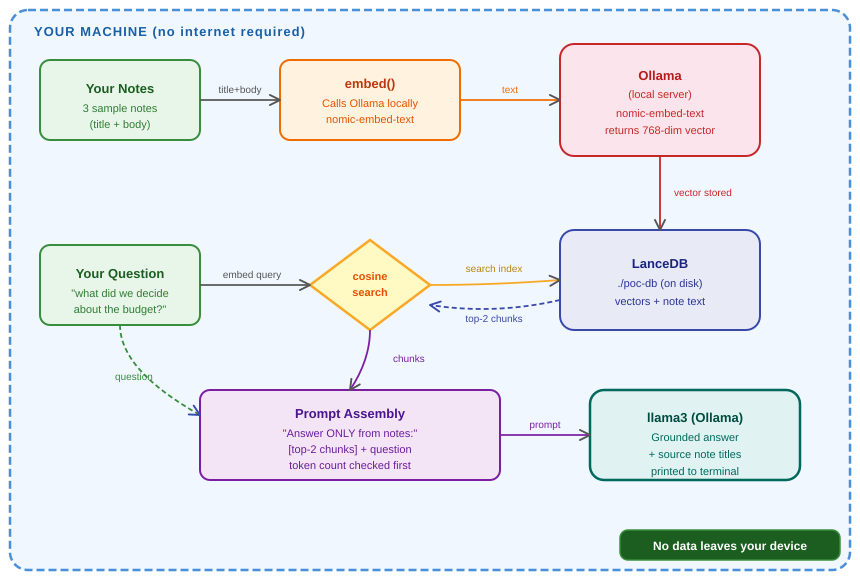

# joplin-rag-poc

> **Proof of Concept** — Natural language Q&A over a local note collection using Retrieval-Augmented Generation (RAG).  
> Built as evidence for my [GSoC 2026 proposal](https://summerofcode.withgoogle.com/) to add AI-powered chat to [Joplin](https://joplinapp.org/).

---

## What this does

This script validates the **core RAG pipeline** that the full Joplin plugin will be built on:

1. **Embeds** note text into vectors using `nomic-embed-text` via Ollama (fully local)
2. **Stores** embeddings + note content in LanceDB (file-based, no server needed)
3. **Retrieves** the most semantically relevant notes for any question via cosine similarity
4. **Answers** the question using `llama3` — grounded only in your notes

Everything runs **100% on your machine**. No data leaves your device.

---

## Architecture

```
┌─────────────────────────────────────────────────────────────────┐
│                        YOUR MACHINE                             │
│                                                                 │
│   ┌─────────────┐    embed()     ┌──────────────────────────┐   │
│   │  Your Notes │ ────────────▶  │  Ollama (local server)   │   │
│   │  (3 sample) │                │  nomic-embed-text model  │   │
│   └─────────────┘                └────────────┬─────────────┘   │
│                                               │ 768-dim vector  │
│                                               ▼                 │
│   ┌─────────────┐  cosine search ┌──────────────────────────┐   │
│   │  Your Query │ ────────────▶  │  LanceDB  (./poc-db)     │   │
│   │  (question) │                │  vectors + note text     │   │
│   └─────────────┘                └────────────┬─────────────┘   │
│                                               │ top-2 chunks    │
│                                               ▼                 │
│   ┌─────────────────────────────────────────────────────────┐   │
│   │  Prompt = "Answer using ONLY these notes: [chunks]"     │   │
│   │                          +  your question               │   │
│   └─────────────────────────────┬───────────────────────────┘   │
│                                 │                               │
│                                 ▼                               │
│                    ┌────────────────────────┐                   │
│                    │  llama3 (via Ollama)   │                   │
│                    │  Grounded answer +     │                   │
│                    │  source note titles    │                   │
│                    └────────────────────────┘                   │
└─────────────────────────────────────────────────────────────────┘
```

---

## RAG Pipeline Diagram

<p align="center">

</p>

---

## Prerequisites

| Tool | Purpose | Download |
|------|---------|----------|
| Node.js 18+ | Runs the script | [nodejs.org](https://nodejs.org) |
| Ollama | Runs AI models locally | [ollama.com/download](https://ollama.com/download) |
| Git | Version control | [git-scm.com](https://git-scm.com) |

---

## Setup & Run

### 1. Clone the repo

```bash
git clone https://github.com/madhan112007/joplin-rag-poc
cd joplin-rag-poc
```

### 2. Install Node dependencies

```bash
npm install
```

### 3. Install Ollama models

```bash
ollama pull nomic-embed-text   # embedding model (~274 MB)
ollama pull llama3             # LLM for answers (~4.7 GB)
```

> Both models run **100% locally**. No API keys needed.

### 4. Run the POC

```bash
npx tsx poc-rag.ts
```

---

## Expected Output

```
Embedding note: Meeting notes Jan...
Embedding note: RAG paper summary...
Embedding note: Grocery list...

Indexed 3 notes successfully.

Top results for: "what did we decide about the budget?"
  [1] Meeting notes Jan: Discussed Q1 budget with Sarah. Decided to cut travel costs by 20%.
  [2] RAG paper summary: Retrieval-Augmented Generation combines dense retrieval...

Asking llama3...

Answer: Based on the meeting notes, you decided to cut travel costs by 20%.
```

---

## What I observed

While running this POC, I made three observations that directly influenced the full plugin design:

1. **Semantic search works without keyword overlap** — the question *"what did we decide about the budget?"* correctly retrieved the note containing *"cut travel costs"* even though "budget" doesn't appear in that exact form. This confirms embedding-based retrieval is the right approach for Joplin's use case.

2. **LanceDB needs no configuration** — the database initialised in under 100ms and persisted to a `./poc-db` folder on disk with zero setup. This is ideal for a Joplin plugin where users should not need to run a separate server.

3. **Joplin's `joplin.data.get()` paginates at 100 items** — discovered while reading the Joplin codebase. The real plugin's ingestion pipeline loops with `page` increments until `has_more` is `false`.

---

## Project Structure

```
joplin-rag-poc/
├── poc-rag.ts          # Main proof-of-concept script
├── package.json        # Node dependencies
├── tsconfig.json       # TypeScript config
├── poc-db/             # LanceDB database (created on first run)
└── README.md           # This file
```

---

## Connection to GSoC Proposal

This POC is the foundation for my GSoC 2026 proposal: **"Chat with Your Note Collection Using AI"** for Joplin.

The full plugin will extend this pipeline with:
- Native Joplin plugin integration via the Plugin API
- React chat UI panel inside Joplin
- Hybrid BM25 + semantic re-ranking for better retrieval
- Incremental background indexing on note change
- Support for OpenAI as an alternative LLM backend
- Source citations with one-click navigation to the original note

---

## License

MIT